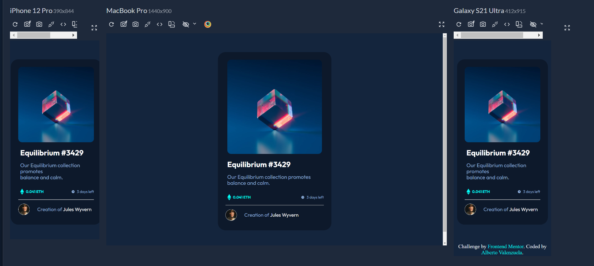

# Frontend Mentor - NFT preview card component solution

This is a solution to the [NFT preview card component challenge on Frontend Mentor](https://www.frontendmentor.io/challenges/nft-preview-card-component-SbdUL_w0U). Frontend Mentor challenges help you improve your coding skills by building realistic projects. 

## Table of contents

- [Overview](#overview)
  - [The challenge](#the-challenge)
  - [Screenshot](#screenshot)
  - [Links](#links)
- [My process](#my-process)
  - [Built with](#built-with)
  - [What I learned](#what-i-learned)
  - [Continued development](#continued-development)
- [Author](#author)
- [Acknowledgments](#acknowledgments)

## Overview

### The challenge

Users should be able to:

- View the optimal layout depending on their device's screen size
- See hover states for interactive elements

### Screenshot



### Links

- Solution URL: [Add solution URL here](https://your-solution-url.com)
- Live Site URL: [https://nftproductcard-front.netlify.app]

## My process

### Built with

- Semantic HTML5 markup
- CSS custom properties
- Flexbox
- CSS Grid
- Responsively

**Note: These are just examples. Delete this note and replace the list above with your own choices**

### What I learned

Use this section to recap over some of your major learnings while working through this project. Writing these out and providing code samples of areas you want to highlight is a great way to reinforce your own knowledge.

To see how you can add code snippets, see below:

```html
<h1>Some HTML code I'm proud of</h1>
      <div class="wrapper__illustration">
        <div class="wrapper__img">
          
          <div class="overlay">
            
          </div>
        </div>
      </div>
```
```css
.proud-of-this-css {
  @media (max-width: 420px) {
    .container{
        width: 24rem;
        height: auto;
    }

    .wrapper__illustration{
        display: flex;
        justify-content: center;
        align-items: center;
    }
    
    .wrapper__img {
        margin: 0;
    }

    .attribution{
        color: white;
        text-align: center;
        font-size: 1.4rem;
    }

    .attribution a{
        color: var(--Cyan);
    }
}
}
```
```js
const proudOfThisFunc = () => {
  console.log('🎉')
}
```

### Continued development
Goinf forward to Front End Challenges and keeping watch helpful resources.

## Author

- Frontend Mentor - [@AlbertoVaMa](https://www.frontendmentor.io/profile/AlbertoVaMa)
- Twitter - [@Betungas18](https://x.com/Betungas18)


## Acknowledgments

My tip is to keep studying all the hard stuff to achieve all of your dreams.
